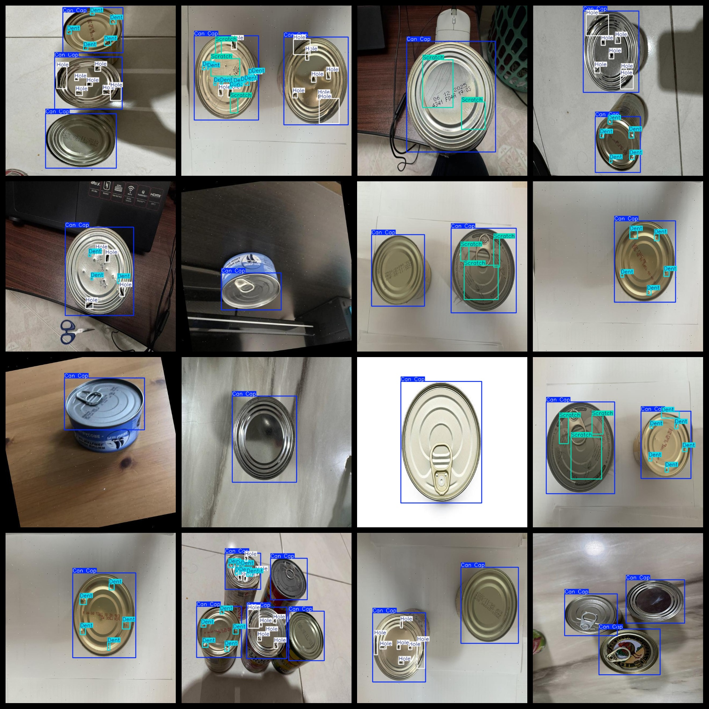

# Can Bottle Defect Detection Dataset 610 imagesVOC+YOLO

Can Bottle Defect Detection Dataset 610stretchVOC+YOLO

Dataset format: Pascal VOC format + YOLO format (the txt file does not contain the split path, it only contains jpg images and corresponding VOC format xml files and yolo format txt files)

Number of images (total number of jpg files): 610

Number of XML Files: 610

Number of txt files: 610

Number of annotated categories: 4

The Github repository is: datasets_sl

["Can Cap", "Dent", "Hole", "Scratch"]

Number of boxes labeled in each category:

Can Cap frame count = 1175

Dent frame count = 1399

Hole frame count = 1394

Scratch frame count = 446

Total Frames: 4414

Number of images per category:

Can Cap occupies picture count = 610

Dent's possession of images = 188

Hole occupies picture count = 208

Scratch has 135 images.

Image resolution: 640x640

Use the labeling tool: labelImg

Dataset Augmentation: Yes

Rules for annotation: Draw a rectangle around the category.

Important note: The dataset does not have been divided into training, validation, and testing sets.

Special Disclaimer: This dataset does not guarantee the accuracy of the trained models or weight files.

Annotation and image details are as follows:

## Images

---

Here is a pay link on Stripe (https://buy.stripe.com/3cs8yP7sY87d0vu9AB). Please contact me lonlonago@foxmail.com after funding $89, and I will send you a complete data files, thank you!

